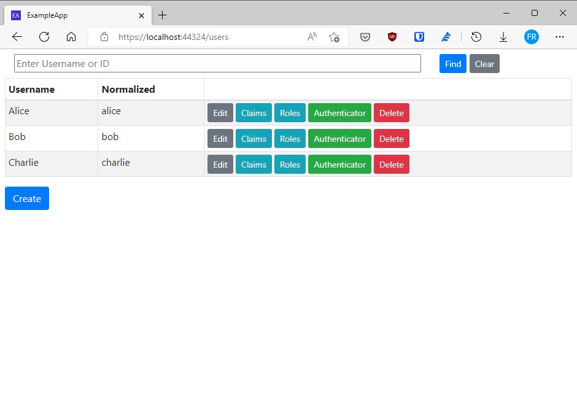
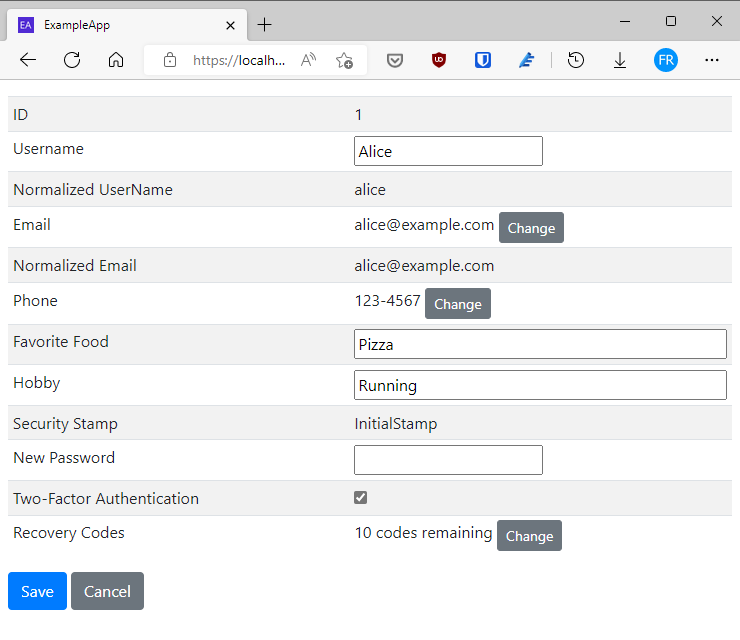
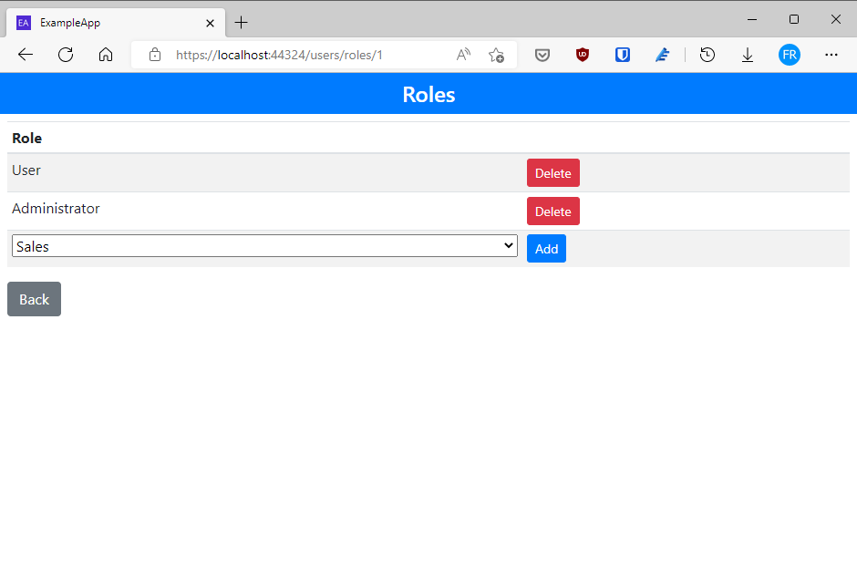
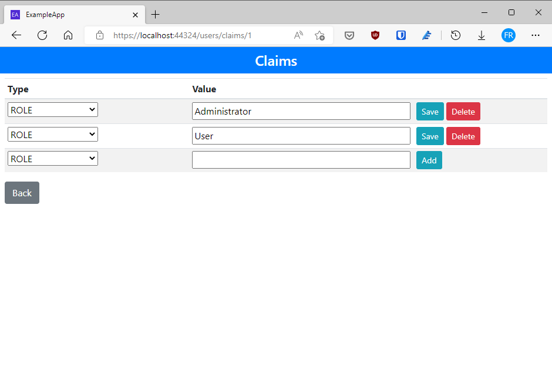
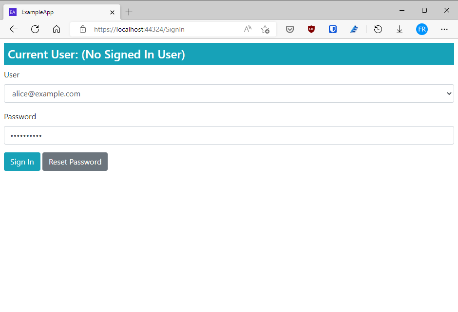
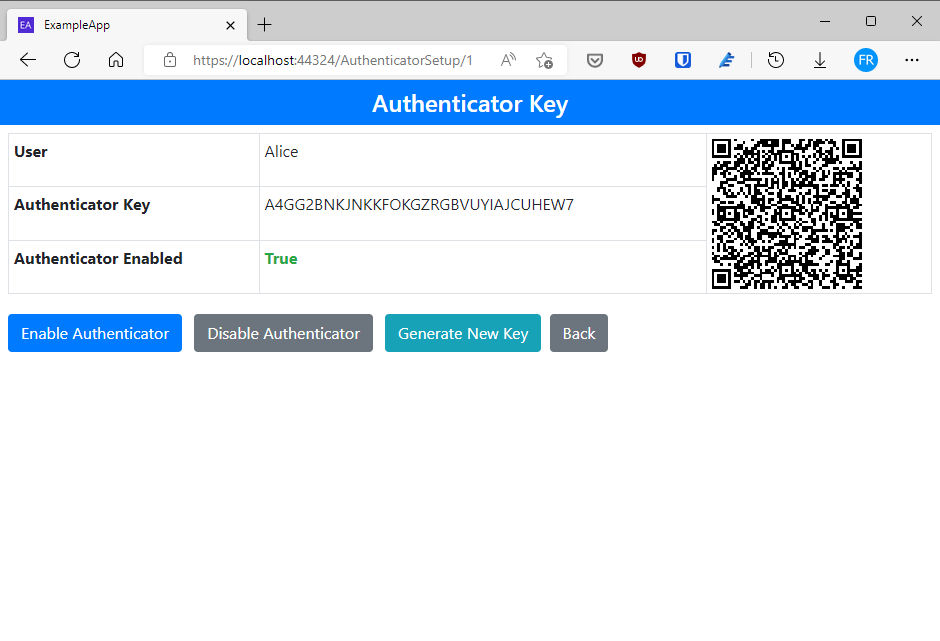

# ExampleApp

[![Build status][ci-badge]][ci-status]

Based on the Web Application built in the Book ['Pro ASP.NET Core Identity'][1] by Adam Freeman (Apress, 2021).

This application corresponds to the ExampleApp built in Part II of the book.

> In this part of the book, I explain how Identity works,
revisiting the major features and describing what happens behind the scenes.
I create custom user role stores, use custom user and role classes,
and implement many of the interfaces that ASP.NET Core Identity uses.

## Prerequisites

- .NET 5
- Visual Studio 2022

## Getting started

1. Clone the project.
1. Open the solution file `ExampleApp.sln`.
1. Press F5 to start the application.
1. Open your browser and go to <https://localhost:44324> (if the browser is not launched automatically).

## Screen captures

  
_Users page_

  
_User edit page_

  
_User roles page_

  
_User claims page_

  
_Sign in page_

  
_Authenticator page_

## License

[MIT License](../LICENSE)

Copyright &copy; 2022 Felipe Romero

[1]: https://www.apress.com/la/book/9781484268575
[ci-status]: https://github.com/feliperomero3/AspNetCoreIdentityBook/actions/workflows/AspNetCoreIdentityBook-CI.yml
[ci-badge]: https://github.com/feliperomero3/AspNetCoreIdentityBook/actions/workflows/AspNetCoreIdentityBook-CI.yml/badge.svg
